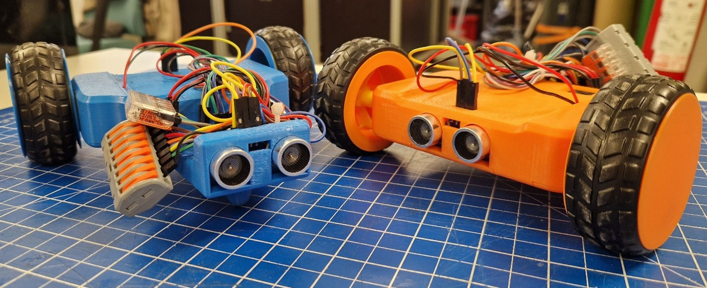

<div align="center">

# 🤖 Rakenna oma mobiilirobotti



**Rakenna oma WiFi-ohjattava mobiilirobotti törmäyksenestolla alusta loppuun!**

[](https://youtu.be/AeR3-ane96E)


*Pullonkaula ry*

</div>

---

## 📖 Tietoa projektista

Rakenna oma mobiilirobotti! Tämä projekti on alun pitäen saanut alkunsa Tampereen kaupungin Masseista mahiksia -tapahtumana 2026. Tapahtumassa yläkoululaiset pääsevät rakentamaan oman mobiilirobotin, jota ohjataan älypuhelimella WiFin välityksellä. Robotti sisältää myös yksinkertaisen törmäyksenestojärjestelmän ultraääniantureiden avulla. Robotin kasausprosessi opettaa käytännön läheisesti sulautettujen järjestelmien toiminnan eli sen miten anturit ja toimilaitteet toimivat yhdessä!

Tapahtuma sopii erinomaisesti kaikille – aiempaa kokemusta ei vaadita. 💡

---

## ✨ Ominaisuudet

- 📱 **WiFi-ohjaus** älypuhelimella selaimen kautta
- 🚧 **Törmäyksenesto** edessä ja takana
- 🖨️ **3D-tulostettu runko**
- ⚡ **AA-paristoilla** toimiva
- 🔧 **Helppo koota**
- 💰 **Kustannustehokas** – noin 20 € / kpl

---

## 🧰 Komponentit

| Komponentti | Määrä | Tehtävä |
|---|---|---|
| ESP8266 D1 mini | 1 | Mikrokontrolleri – robotin "aivot" |
| MP1584EN | 1 | Jännitteenmuuntaja (6V → 3.3V) |
| L298N mini + 470 µF | 1 | Moottorinohjain |
| HC-SR04 | 2 | Ultraäänianturit törmäyksenestoon |
| TT-moottori (1:48) | 2 | Liike |
| 4×AA paristokotelo | 1 | Virtalähde |
| AA paristo | 4 | Virtalähde |
| Vipuliittimet (3-, 5-, 8-napainen) | 1 kpl/tyyppi | Johdotus ilman juottamista |
| 0-0 hyppykaapelit | 8 | Kommunikaatiojohdot |
| 0-1 hyppykaapelit | 12 | Virtajohdot |
| M2×6 mm ruuvi | 3 | Rungon kiinnitys |
| Nippuside | 2 | Johtojen siistiminen |

> **Työkalut:** Tietokone, USB-C-kaapeli, ristipääruuvimeisseli, sivuleikkurit

---

## 📁 Projektin rakenne

```
📦 Rakenna oma mobiilirobotti
├── 📂 3D-mallit
│   ├── 📂 Solidworks          ← Alkuperäiset SolidWorks-tiedostot
│   │   ├── Komponentit
│   │   └── Tulostettavat osat
│   ├── 📂 STEP                ← Universaali formaatti muille CAD-ohjelmille
│   └── 📂 STL                 ← Suoraan 3D-tulostimeen!
├── 📂 Dokumentaatio
│   └── Kasausohje (.pdf & .docx)
├── 📂 Koodit
│   └── Mobiilirobotin_koodi
│       └── Mobiilirobotin_koodi.ino   ← Arduino-koodi ESP8266:lle
└── 📂 Kuvia
    ├── Mobiilirobotin kytkentäkaavio.png
    ├── Mobiilirobotit.jpg
    └── Pullonkaula.jpg
```

---

## 🚀 Pikaopas kasaukseen

> 📄 Löydät täyden ohjeen hakemistosta [`Dokumentaatio/`](Dokumentaatio/)  
> 🎬 Tai katso kasausvideo: [youtu.be/AeR3-ane96E](https://youtu.be/AeR3-ane96E)

### 1️⃣ Koodin asennus

<details>
<summary><b>Asenna Arduino IDE</b></summary>

1. Mene osoitteeseen [arduino.cc/en/software](https://www.arduino.cc/en/software)
2. Lataa **Arduino IDE** omalle käyttöjärjestelmällesi (Windows / macOS / Linux)
3. Asenna ohjelma normaalisti asennusvelhon ohjeiden mukaan
4. Käynnistä Arduino IDE

</details>

<details>
<summary><b>Asenna ESP8266-tuki Arduino IDE:hen</b></summary>

1. Avaa Arduino IDE ja mene **File → Preferences**
2. Lisää **Additional boards manager URLs** -kenttään:
   ```
   https://arduino.esp8266.com/stable/package_esp8266com_index.json
   ```
3. Mene **Tools → Board → Boards Manager**, hae `esp8266` ja asenna **ESP8266 by ESP8266 Community**
4. Valitse kortiksi **Tools → Board → ESP8266 Boards → LOLIN(WEMOS) D1 mini (clone)**

</details>

<details>
<summary><b>Asenna tarvittavat kirjastot</b></summary>

Seuraavat kirjastot täytyy asentaa ennen koodin lataamista. Kirjastot löytyvät Arduino IDE:n kirjastonhallinnasta (**Tools → Manage Libraries…**) tai GitHub-linkeistä.

| Kirjasto | Asennus |
|---|---|
| `ESP8266WiFi` | Tulee automaattisesti ESP8266-tuen mukana |
| `DNSServer` | Tulee automaattisesti ESP8266-tuen mukana |
| `LittleFS` | Tulee automaattisesti ESP8266-tuen mukana |
| `ESPAsyncTCP` | Hae nimellä **ESPAsyncTCP** kirjastonhallinnasta |
| `ESPAsyncWebServer` | Hae nimellä **ESPAsyncWebServer** kirjastonhallinnasta |

> ⚠️ Jos `ESPAsyncTCP` tai `ESPAsyncWebServer` eivät löydy kirjastonhallinnasta, asenna ne manuaalisesti GitHubista:
> - [ESPAsyncTCP](https://github.com/me-no-dev/ESPAsyncTCP) → Code → Download ZIP → **Sketch → Include Library → Add .ZIP Library**
> - [ESPAsyncWebServer](https://github.com/me-no-dev/ESPAsyncWebServer) → sama menettely

</details>

Avaa `Koodit/Mobiilirobotin_koodi/Mobiilirobotin_koodi.ino` Arduino IDE:ssä. Muokkaa **riveille 2 ja 3** robotille haluamasi WiFi-verkon nimi ja salasana:

```cpp
String robotName = "MunRobotti";
static const char* AP_PASSWORD = "OmaSalasana"; // 8–63 merkkiä
```

Yhdistä ESP8266 D1 mini USB-C-kaapelilla tietokoneeseen ja paina Arduino IDE:ssä vasemman yläkulman **→ (Upload)**. Koodi on latautunut onnistuneesti, kun näet ilmoituksen `Done uploading`.

### 2️⃣ 3D-tulosta osat
Tulosta kaikki viisi osaa `3D-mallit/STL/`-kansiosta. Osat ovat:
- Ylärunko
- Alarunko
- Paristopidike
- Pölykapseli (×2)
- Sisäkapseli (×2)

### 3️⃣ Kokoa elektroniikka
Paina komponentit runkoon, reititä moottorien johdot ja asenna paristokotelo.

### 4️⃣ Kytke johdot
Kytke ensin kaikki virtajohdot vipuliittimien kautta, sitten kommunikaatiojohdot ESP8266:een. Katso kytkentäkaavio alta! ⬇️

### 5️⃣ Testaa
Käynnistä robotti, yhdistä puhelimella robotin WiFi-verkkoon ja avaa selaimessa `192.168.4.1`. Ohjaa!

### 6️⃣ Viimeistely
Ruuvaa pohja kiinni kolmella M2-ruuvilla ja siisti johdot nippusiteillä.

---

## 🔌 Kytkentäkaavio

<details>
<summary><b>Näytä kytkentäkaavio</b></summary>


**Pääperiaate:**
- 🔴 **6 V** (paristot) → L298N mini ja MP1584EN sisääntulo
- 🟠 **3.3 V** (MP1584EN ulostulo) → ESP8266 D1 mini ja HC-SR04-anturit
- ⚫ **GND** → kaikki komponentit yhteiseen 8-napaiseen vipuliittimeen

**Kommunikaatiojohdot (ESP8266):**

| L298N / HC-SR04 | ESP8266-pinni |
|---|---|
| IN1 | D1 |
| IN2 | D2 |
| IN3 | D6 |
| IN4 | D5 |
| Etuanturi Trig | D7 |
| Etuanturi Echo | D8 |
| Takaanturi Trig | D0 |
| Takaanturi Echo | D3 |

</details>

---

## 🎬 Kasausvideo

[](https://youtu.be/AeR3-ane96E)

---

## 📜 Lisenssi

Tämä projekti on kehitetty opetuksellisiin tarkoituksiin, kaupallinen käyttö kielletty.  
Kehittäjä: **Aapo Kekkonen**
